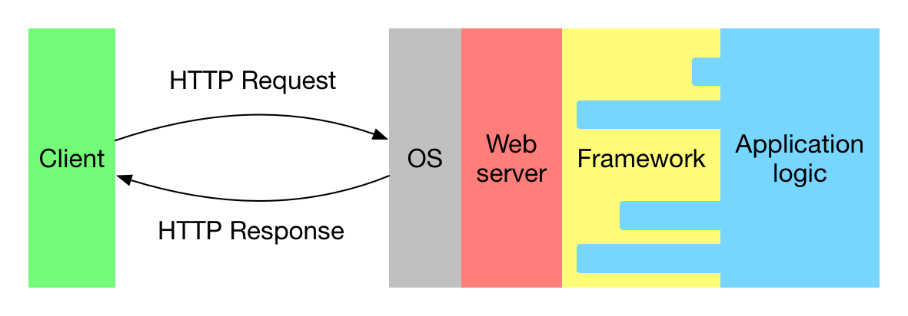

layout: true
name: implementation
class: center, middle

## [Implementation demo]

---
layout: false
class: center, middle

<h1>Build yourself a<br> Haskell web framework</h1>

HaskellerZ meetup &mdash; 27 October 2016<br>
Carl Baatz

https://github.com/cbaatz/build-a-haskell-web-framework

---

## Objectives

Web frameworks &mdash; Yesod, Snap, Scotty, or Spock for example &mdash; help us implement web servers. But what goes on behind the scenes of such a framework? We'll try to understand that better today by writing our own super simple Haskell web framework.

## Prerequisites

- Familiarity with Haskell syntax.
- Familiarity with monads.
- Intended to be beginner friendly.

## Ask questions if you're confused!

???

- Build a mental model of a web framework.
- We'll build a simple web framwork.
- Not mature or feature complete.
- Not a statement on how frameworks *should* be built.
- Experience with monads?
- A good example of how useful custom monads can be.
- Beginner friendly.
- Ask questions!

---
class: center, middle

# A bit of background.

---
layout: true
name: web-server

# What is a web server?

A *web server* accepts **HTTP requests** and returns **HTTP responses**.
---
---

### HTTP request

```plain_text
POST /sign-in/ HTTP/1.1
Host: example.com
Content-Length: 45
Cache-Control: no-cache
User-Agent: Mozilla/5.0 (Macintosh; Intel Mac OS X 10_11_6) AppleWebKit/537.36 (KHTML, like Gecko) Chrome/53.0.2785.143 Safari/537.36
Content-Type: application/x-www-form-urlencoded
Accept: text/html,application/xhtml+xml,application/xml;q=0.9,image/webp,*/*;q=0.8

identifier=username&password=mypassword
```

???

- Method
- Path (URL)
- Headers
- Body

---

### HTTP response

```plain_text
HTTP/1.1 401 NOT AUTHORIZED
Server: nginx/1.6.2
Date: Sun, 23 Oct 2016 20:43:31 GMT
Content-Type: text/html; charset=utf-8

<!DOCTYPE HTML><html><head><script src="/assets/main.js"></script></head><body><h1>Not authorized</h1></body></html>
```

???

- Status code
- Headers
- Body

---
layout: false

# What is a web framework?

A web framework sits on top of some web server and provides developers with structure and tools to make it easier to implement a web server application.



???

- Web framework provides structure and helper functions.
- Application logic hooks into web framwork.

---
# What do frameworks do?

Functionality varies widely between frameworks; some features on offer might be:

- **Routing**: divide your code by request method and URL.
- **Request/response access**: DSL for reading requests and manipulating responses.
- **Common tasks**: Redirection, content type setting, link generation.
- **Templating**: HTML or CSS templating.
- **Security**: Guard against XSS, CSRF, and SQL-injection.
- **Data models**: Tools for accessing your data
- **Sessions**: Track identity between requests.
- **Codebase structure**: Specify file naming and organisation.
- ...

In the interest of time and clarity our framework will have only a few of these features.

???

- What else do you want from a framework?
- Feature sets vary widely.
- Framework vs libraries.
- Libraries more flexible, but require more knowledge and glue code.
- Our framework will have minimal features.
- Hopefully it should be clear how to add more features on top however.

---
class: center, middle

# Let's get started.

---

# A Haskell web server

The `wai` package gives us an API for writing web server applications against HTTP `Request` and `Response` types in `Network.Wai`.

```haskell
data Request -- Abstract
data Response -- Abstract
type Application :: Request -> (Response -> IO ResponseReceived) -> IO ResponseReceived

app :: Request -> (Response -> IO ResponseReceived) -> IO ResponseReceived
app req respond = respond (responseLBS status200 [] "Hello, world!")
```

`Application` is in continuation passing style &mdash; we get a request and a continuation function which we call with our response.

???

- WAI = Web Application Interface
- Most of the newer frameworks use WAI

---

# A Haskell web server

The `warp` package implements a web server that can serve applications written to the WAI API. `run` in `Network.Wai.Handler.Warp` will:

- Bind to a port (3000 in the example below)
- Parse incoming requests into WAI `Request`s
- Serialize and return the application's WAI `Response`s

```haskell
run :: Port -> Application -> IO ()

main :: IO ()
main = run 3000 app
```

???

- There are other backends to WAI like CGI and FastCGI, but Warp is a common choice.

---

template: implementation

A "Hello, world!" web server.

---
name: routing

# Routing

The first thing we usually want to do when a request comes in is to *route* it to an appropriate *handler* based on the request method and path. Existing frameworks provide a variety of solutions for this.

???

- We could write an arbitrarily complex web application based on this.
- Working with "raw" `Request`s and `Response`s is awkward.
- Routing is often the first thing we want to do.

---
template: routing

## Yesod

```haskell
mkYesod "Piggies" [parseRoutes|
  /      HomeR  GET
  /about AboutR GET
|]
```

Yesod uses Template Haskell to provide a DSL for the routing table.

---
template: routing

## Spock

```haskell
  site = do
    get "/" $
      html "<a href='/calculator/313/+/3'>Calculate 313 + 3</a>"
    get ("hello" <//> ":name") $ do
      name <- param' "name"
      text $ "Hello " <> name <> "!"
    get ("calculator" <//> ":a" <//> "+" <//> ":b") $ do
      a <- param' "a"
      b <- param' "b"
      text $ pack $ show (a + b :: Int)
```

---
template: routing

## Snap

```haskell
site =
    ifTop (writeBS "hello world") <|>
    route [ ("foo", writeBS "bar")
          , ("echo/:echoparam", echoHandler)
          ] <|>
    dir "static" (serveDirectory ".")
```
---

# Routing

To keep things simple, we'll use an `attoparsec` parser and normal function application to route requests:

```haskell
data Route = Home | Message Int

parser :: Parser Route
parser = choice
    [ string "/" <* endOfInput >> return Home
    , string "/messages/" >> fmap Message (decimal <* endOfInput)
    ]

router :: Method -> Route -> IO Response
router GET Home = homeHandler
router GET (Message messageId) = messageHandler messageId
router _ _ = return notFound

notFound :: Response
```

(Wait a minute, where's the request? We'll get to that.)

???

- `Route` is an ADT for "locations" in our application.
- `Method` is the HTTP method.
- There are several approaches to parsing paths.
- We'll use an `attoparsec` parser. Less pretty, but simple, powerful, and a useful general skill.
- We'll want a pretty printer as well later. Need to be kept in sync.
- Can test pretty printer works. Parser can be more lenient however.

---
template: implementation

Routing functionality.

???
---

# Handlers

Now that we can route requests to handlers we ask ourselves: how should we write our handlers? We know we'll want to do things like:

- Load data from the database
- Log information
- Read headers and cookies
- Read query parameters
- Check authorization
- Construct absolute URLs
- ...

To do that we need access to things like the request, configuration, and DB and logger handles (IO functions that access the DB or write log messages).

---
layout: true

# The `Handler` monad

We could choose to pass these values around explicitly or to bundle them up in a Reader monad. To reduce glue-code and allow us to add other useful functionality later, we're going to go with a `Handler` monad.

---

## Explicit arguments

```haskell
myHandler :: Config -> Request -> DBHandle -> LogHandle -> IO Response
myHandler config req dbHandle logHandle = do
    log logHandle Info "Reached myHandler"
    userIdMay <- getLoggedInUser req dbHandle logHandle
    case userIdMay of
        Nothing -> return notFound
        Just userId -> do
            userInfoMay <- fetchUserInfo dbHandle logHandle userId
            return $ maybe notFound renderUserInfo userInfoMay
```

---

## Reader monad

```haskell
myHandler :: Handler Response
myHandler = do
    log "Reached myHandler"
    userIdMay <- getLoggedInUser
    case userIdMay of
        Nothing -> return notFound
        Just userId -> do
            userInfoMay <- fetchUserInfo
            return $ maybe notFound renderUserInfo userInfoMay
```

---
template: implementation
layout: false

A `Handler` reader monad with the `Request` in the environment.

---
layout: false

# Setting headers and status

Now we move on to actually produce the response and realise that it's a bit awkward to manage headers:

```haskell
home :: Handler Response
home = do
    let cacheHeader = ("Cache-control", "no-cache")
    userIdMay <- getLoggedInUser
    (body, headers, status) <- case userIdMay of
        Just userId -> homeForUser userId
        Nothing -> publicHome
    return (responseLBS status ([cacheHeader] <> headers) body)
```

Here we manually construct a list of headers that we finally include in the response. Having to explicitly name and merge headers as we split up our handlers is annoying.

---

# Setting headers and status

What if we hide the response headers in the `Handler` monad and create functions to add and change them? Then we can do something like this:

```haskell
home :: Handler Body
home = do
    addHeader "Cache-control" "no-cache"
    userIdMay <- getLoggedInUser
    case userIdMay of
        Just userId -> homeForUser userId
        Nothing -> publicHome
```

---
template: implementation

Add state with headers and status to the `Handler` monad.

???

- We'll also put the status in there since that's convenient.
- We can set status at the most appropriate point in our handler, not just at the end.
- We can return just the body from our handler.
- We could also put the body in the state.
- Requiring our handlers to return a body add some type safety.

---

# Exceptions and failure

Our `Handler` monad is starting to feel a bit like a framework, but one key features is missing. What happens when it's not all rainbows and unicorns? Let's say we need to write a handler for a restricted part of our website:

```haskell
restricted :: MessageId -> Handler L.ByteString
restricted messageId = do
    messageMay <- fetchMessage messageId
    case messageMay of
        Nothing -> notFound
        Just message -> do
            userIdMay <- getLoggedInUserId
            case userIdMay of
                Nothing -> notFound
                Just userId -> if messageOwnerId message == userId
                    then renderMessage message
                    else notFound
 ```

---
class: center, middle
.small[]
---

# Exceptions and failure

Not nice. We want to tell our functions: *give me what I want, or don't bother returning*.

Well, there's a monad for that: the `Except` monad. If we add that functionality to our `Handler` monad we can bail whenever we want and rewrite our handler like this:

```haskell
restricted :: MessageId -> Handler L.ByteString
restricted messageId = do
    message <- requireMessage messageId
    userId  <- requireUserId
    notFoundWhen (messageOwnerId message != userId)
    renderMessage message
```

Nice.

???

- Could tidy up the previous version with `LambdaCase`, but structure remains.
- Functions now have a concept of success and failure.
- If they fail, the rest of the handler is skipped.

---
template: implementation

Add failure functionality to the `Handler` monad.
---

# Expanding on the core

We've now laid the foundation for a framework. It's lacking polish and features, but the basic structure is there: routing, environment access, response manipulation, and app level exception handling. If we were to expand on this core the next steps might be:

- More helpers (`permanentRedirect`, `temporaryRedirect`, `removeHeader`, `setHeader`, `setCookie`, `removeCookie`, etc.).
- DB and logger handles in the `Handler` environment.
- Link generation.
- Automatic redirection to canonical URLs.
- Automatic selection of appropriate response representation.
- Form handling and CSRF protection.
- Configuration options (auto-append slashes, log level, etc.)
- ...

---
class: middle, center

# Questions?
---
class: middle, center

# Discussion

What do you want out of a web framework?

Which frameworks do you prefer?

How can the Haskell eco-system improve on web development?

---
layout: true

# Appendix: DB access

To get access to a DB in our handlers, the basic idea is:

1. Create a `DBHandle` with IO functions for accessing the DB.
2. Add the `DBHandle` to the `Handler` environment.
3. Write a `withDB :: (DBHandle -> IO a) -> Handler a` function.
4. Initialise a `DBHandle` in the main function.
5. Pass the `DBHandle` to the app function so we can put it in the environment.
6. Access the DB via the `withDB` function in handlers.

---

```haskell
data DBHandle = DBHandle
    { dbWrite :: Text -> Text -> IO ()
    , dbRead  :: Text -> IO (Maybe Text)
    }

initDB :: IO DBHandle
```

```haskell
withDB :: (DBHandle -> IO a) -> Handler a
withDB action = do
    dbHandle <- asks envDBHandle
    liftIO $ action dbHandle
```
---

```haskell
main = do
    dbHandle <- initDB
    run 3000 (app dbHandle)
```

```haskell
myHandler :: Int -> Handler ()
myHandler i = do
    withDB (\db -> dbWrite db "latest" (tshow i))
```

???

- Create a basic DBHandle with write and read functions in a DB module.
- initDB :: IO DBHandle
- Add DBHandle to Handler env.
- withDB :: (DBHandle -> IO a) -> Handler a
- Initialise DB handle in the main function.
- Use withDB and the DBHandle functions in the handlers.

---
layout: false

# Appendix: Link generation

1. Write a (pure) pretty printer for the `Route` type.
2. Pass `Route` values to the pretty printer in your templates or wherever you need them.

Note that the pretty-printer can be tested by running `Route` values through the pretty printer and then the parser checking that you get the same thing back. The parser can be more lenient than that, but that's often OK or even desireable.

```haskell
printRoute :: Route -> ByteString
printRoute Home = "/"
printRoute About = "/about/"
printRoute (Message i) = "/messages/" <> (encodeUtf8 $ tshow i)
```

---

# Appendix: Canonical URLs

If we have a pretty printer for `Route`, we can easily redirect to canonical links automatically.

1. After parsing the route successfully, check if it's a GET request.
2. Pretty print the parsed `Route` and check that it matches the raw path in the request.
3. If they don't match, return a redirect response to the pretty printed route.

```haskell
case (methodEither, routeEither) of
    (Right method, Right route) -> do
        response <- if (printRoute route) == (rawPathInfo req)
            then runHandler (router method route) env
            else runHandler (throwError $ BailRedirect (printRoute route)) env
        respond response
```
---

# Appendix: Representations

HTTP requests can ask for a particular representation type &mdash; HTML, plain text, JSON, etc.. We can introduce a `Body` type that includes all the representations the handler knows how to produce (which should be efficient because of laziness) and then choose a particular representation in the `runHandler` based on the request's `Accept` header.

```haskell
data Body = Body {
    { bodyHtml :: Maybe Html
    , bodyJSON :: forall j. ToJSON j => Maybe j
    , bodyOthers :: [(ByteString, L.ByteString)]
    }
```

```haskell
router :: StdMethod -> Route -> Handler (Maybe Body)
```

Another option would be to put the bodies in the `Handler` state together with the headers and status. That would probably make for neater handlers, but remove the check that handlers conciously return a body (or `Nothing`).
